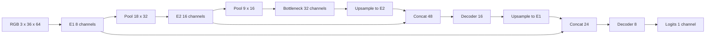

# Compact custom U-Net — F10

โมเดลเขียนใน model.py และ initialize ทุก layer ใหม่ ไม่ load pretrained weights
Input เป็น RGB W×H=64×36; PyTorch tensor layout คือ N,C,H,W
Output ของโมเดลเป็น logits หนึ่ง channel ก่อน sigmoid

| Stage | Operations | Shape N,C,H,W |
|---|---|---|
| Input | RGB / 255 | N,3,36,64 |
| Encoder 1 | Conv3→8→8, ReLU, k=3 p=1 | N,8,36,64 |
| Pool 1 | MaxPool2×2 | N,8,18,32 |
| Encoder 2 | Conv8→16→16, ReLU | N,16,18,32 |
| Pool 2 | MaxPool2×2 | N,16,9,16 |
| Bottleneck | Conv16→32→32, ReLU | N,32,9,16 |
| Decoder 2 | Bilinear up to E2; concat32+16; Conv48→16→16 | N,16,18,32 |
| Decoder 1 | Bilinear up to E1; concat16+8; Conv24→8→8 | N,8,36,64 |
| Head | Conv1×1 8→1 | N,1,36,64 |

จำนวน parameters ตรวจจากโมเดลจริง = 29,761; FP32 parameter bytes = 119,044
ไม่มี BatchNorm buffers; parameter storage ไม่เท่ากับ inference memory footprint

เหตุผลของ implementation: lane-area เป็น semantic region กว้าง จึงเริ่ม input เล็กเพื่อ memory ต่ำ
64×36 รักษา 16:9; สอง pooling stages ให้ spatial size ลงตัวถึง 9×16
Skip connections ส่งรายละเอียดระดับต้นกลับ decoder; bilinear upsampling ไม่เพิ่ม trainable upsampling parameters
Channels 8/16/32 ทำให้ model เล็ก โดยความเหมาะสมต้องอ่านจาก held-out metrics/failure snapshots ที่วัดจริง
